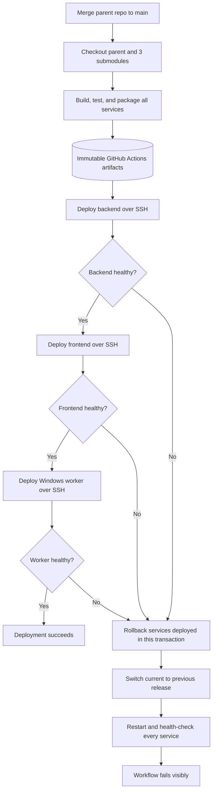
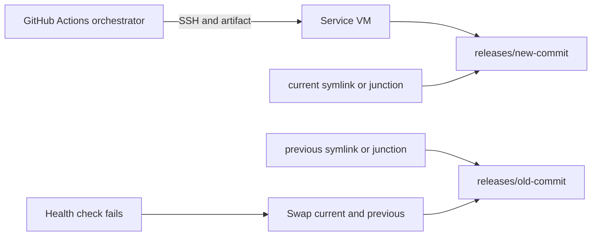

# Multi-Service Deploy Pipeline

This repository is a small, realistic deployment design for a startup running three
services on separate virtual machines:

| Service | Runtime | Target | Health endpoint |
| --- | --- | --- | --- |
| `backend` | Go | Linux VM | `/health` |
| `frontend` | Next.js | Linux VM | `/api/health` |
| `worker` | Python | Windows VM | `http://127.0.0.1:9090/health` |

The service directories are Git submodules. A merge to the protected `main` branch
updates the parent repository's submodule pointers and triggers one coordinated
production deployment. Direct pushes technically trigger the same workflow, so
branch protection should require pull requests.

## Architecture and flow

GitHub Actions builds all three services before changing production. The build job
tests or syntax-checks each service, produces immutable artifacts named by the
parent commit SHA, and passes them to the deploy job through GitHub Actions
artifacts.

The deploy job connects to each VM over SSH and deploys sequentially:

1. Backend
2. Frontend
3. Windows worker

Sequential deployment is intentionally simple and makes the failure point obvious.
The orchestrator uses an `ERR` trap: if upload, restart, or health checking fails
for any service, it invokes coordinated rollback for services already deployed in
the current transaction. A production GitHub Environment provides an audit trail
and can optionally require an approval before deployment. The concurrency group
permits only one production rollout at a time.



Each target VM keeps its own release history:



## Release and rollback strategy

Linux services use this layout:

```text
/opt/app-stack/<service>/
  releases/<parent-commit-sha>/
  current  -> releases/<new-sha>/
  previous -> releases/<old-sha>/
```

The deploy script extracts into a new release directory, points `previous` at the
old `current`, switches `current`, restarts systemd, then polls the service health
endpoint for up to 60 seconds. Rollback swaps `current` and `previous`, restarts,
and verifies health again.

The Windows worker uses the same layout under `C:\app-stack\worker`, with PowerShell
directory junctions for `current` and `previous`. A pre-provisioned
`AppWorker` Windows service runs `C:\app-stack\worker\current\worker.py`.

This design makes rollback fast because it changes pointers rather than rebuilding
or downloading an older artifact. Release cleanup is deliberately omitted from
the rollout path; a scheduled task can retain the newest five releases without
adding risk to deployments.

On the very first release there is no `previous` version. A failed first rollout
cannot restore an application that never existed, so rollback logs a warning and
leaves that service unchanged. After the first successful release, coordinated
rollback is available.

## VM prerequisites

Linux VMs require `bash`, `curl`, `tar`, systemd, an `app` service user, and the
included unit files installed as `app-backend.service` or
`app-frontend.service`. The SSH deploy user must have narrowly scoped,
passwordless sudo permission to run the deployment script operations and restart
only the relevant service. Runtime configuration belongs in
`/etc/app-stack/backend.env` and `/etc/app-stack/frontend.env`, not in Git.

The Windows VM requires Python, OpenSSH Server, PowerShell, and a pre-provisioned
`AppWorker` service. Its SSH deploy account needs permission to manage that
service and create junctions under `C:\app-stack\worker`.

Host firewalls should expose application ports only where required. The worker
health endpoint intentionally binds to loopback and is checked from its own VM.

## GitHub Secrets

Configure these as secrets on the `production` GitHub Environment:

| Secret | Purpose |
| --- | --- |
| `DEPLOY_SSH_PRIVATE_KEY` | One restricted deployment key accepted by all three VMs |
| `SSH_KNOWN_HOSTS` | Pinned host keys for all target VMs |
| `BACKEND_HOST`, `BACKEND_USER` | Backend SSH destination |
| `FRONTEND_HOST`, `FRONTEND_USER` | Frontend SSH destination |
| `WINDOWS_HOST`, `WINDOWS_USER` | Worker SSH destination |
| `BACKEND_HEALTH_URL` | VM-local or private backend health URL |
| `FRONTEND_HEALTH_URL` | VM-local or private frontend health URL |

Secrets are expanded only in the deploy job and are never written into release
artifacts. `StrictHostKeyChecking=yes` prevents accepting an impersonated host.
For a larger organization, short-lived credentials or a deployment broker would
be preferable to a long-lived SSH key.

## Failure handling and tradeoffs

- **Build fails:** production is untouched.
- **Upload/restart/health check fails:** the orchestrator rolls back only services
  that successfully deployed earlier in the current transaction. It continues
  trying the remaining applicable rollbacks if one rollback fails, and leaves the
  workflow failed for investigation. Untouched services are not rolled back,
  because moving an unrelated service to its previous release could cause an
  accidental regression.
- **Runner dies mid-deploy:** an `ERR` trap cannot execute. This is the main
  limitation of a runner-driven transaction. The operator reruns the failed
  workflow or invokes the rollback scripts. A mature platform would persist
  rollout state in a deployment controller.
- **Database compatibility:** this example assumes backward-compatible schema
  changes. Destructive migrations must use an expand/contract process because
  application rollback cannot undo data loss.
- **Sequential rollout:** slower than parallel deployment, but easier to reason
  about for three VMs and a startup-sized team.
- **No Kubernetes/configuration-management platform:** SSH and native service
  managers minimize moving parts. At larger scale, image-based deployment and a
  dedicated orchestrator would improve consistency and observability.

## Repository layout

```text
.github/workflows/deploy.yml  Build and coordinated deployment
backend/                      Go service submodule
frontend/                     Next.js service submodule
worker/                       Python Windows-worker submodule
deploy/orchestrate.sh         Cross-service deployment transaction
deploy/linux/                 Linux deploy and rollback scripts
deploy/windows/               Windows deploy and rollback scripts
deploy/systemd/               Example Linux service units
```

## AI usage

OpenAI Codex was used to help draft the repository structure, example services,
deployment scripts, workflow, and documentation. The design decisions, failure
modes, and generated code should be reviewed and explained by the submitter during
the live discussion.
